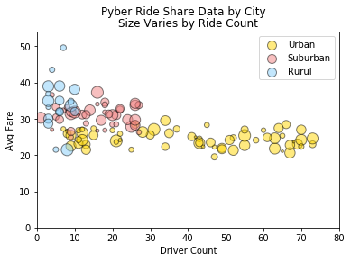
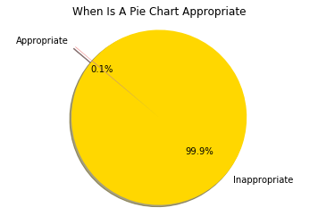
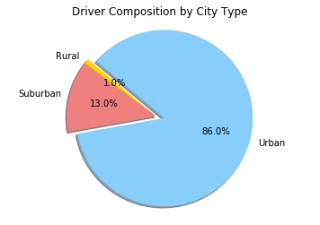
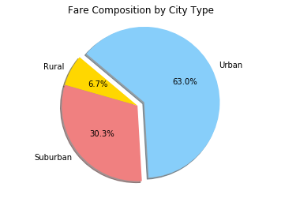
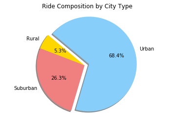

```python
print("Trend 1 - Average fare increases and varies more as you move away from urban cities into rural cities.")
print("Trend 2 - In urban cities the average cost has no correlation to demand for rides and supply of drivers.")
print("Trend 3 - Rural drivers are probably earning more revenue than urban drivers.")
```

    Trend 1 - Average fare increases and varies more as you move away from urban cities into rural cities.
    Trend 2 - In urban cities the average cost has no correlation to demand for rides and supply of drivers.
    Trend 3 - Rural drivers are probably earning more revenue than urban drivers.
    


```python
import pandas as pd
import numpy as np
import matplotlib.pyplot as plt
```


```python
file1 = ("raw_data/city_data.csv")
file2 = ("raw_data/ride_data.csv")
```


```python
df1 = pd.read_csv(file1)
df1.head()

```


<div>
<style>
    .dataframe thead tr:only-child th {
        text-align: right;
    }

    .dataframe thead th {
        text-align: left;
    }

    .dataframe tbody tr th {
        vertical-align: top;
    }
</style>
<table border="1" class="dataframe">
  <thead>
    <tr style="text-align: right;">
      <th></th>
      <th>city</th>
      <th>driver_count</th>
      <th>type</th>
    </tr>
  </thead>
  <tbody>
    <tr>
      <th>0</th>
      <td>Kelseyland</td>
      <td>63</td>
      <td>Urban</td>
    </tr>
    <tr>
      <th>1</th>
      <td>Nguyenbury</td>
      <td>8</td>
      <td>Urban</td>
    </tr>
    <tr>
      <th>2</th>
      <td>East Douglas</td>
      <td>12</td>
      <td>Urban</td>
    </tr>
    <tr>
      <th>3</th>
      <td>West Dawnfurt</td>
      <td>34</td>
      <td>Urban</td>
    </tr>
    <tr>
      <th>4</th>
      <td>Rodriguezburgh</td>
      <td>52</td>
      <td>Urban</td>
    </tr>
  </tbody>
</table>
</div>


```python
df2 = pd.read_csv(file2)
df2.head()
```


<div>
<style>
    .dataframe thead tr:only-child th {
        text-align: right;
    }

    .dataframe thead th {
        text-align: left;
    }

    .dataframe tbody tr th {
        vertical-align: top;
    }
</style>
<table border="1" class="dataframe">
  <thead>
    <tr style="text-align: right;">
      <th></th>
      <th>city</th>
      <th>date</th>
      <th>fare</th>
      <th>ride_id</th>
    </tr>
  </thead>
  <tbody>
    <tr>
      <th>0</th>
      <td>Sarabury</td>
      <td>2016-01-16 13:49:27</td>
      <td>38.35</td>
      <td>5403689035038</td>
    </tr>
    <tr>
      <th>1</th>
      <td>South Roy</td>
      <td>2016-01-02 18:42:34</td>
      <td>17.49</td>
      <td>4036272335942</td>
    </tr>
    <tr>
      <th>2</th>
      <td>Wiseborough</td>
      <td>2016-01-21 17:35:29</td>
      <td>44.18</td>
      <td>3645042422587</td>
    </tr>
    <tr>
      <th>3</th>
      <td>Spencertown</td>
      <td>2016-07-31 14:53:22</td>
      <td>6.87</td>
      <td>2242596575892</td>
    </tr>
    <tr>
      <th>4</th>
      <td>Nguyenbury</td>
      <td>2016-07-09 04:42:44</td>
      <td>6.28</td>
      <td>1543057793673</td>
    </tr>
  </tbody>
</table>
</div>


```python
merge_df = pd.merge(df1, df2, on="city")
merge_df.head()

```


<div>
<style>
    .dataframe thead tr:only-child th {
        text-align: right;
    }

    .dataframe thead th {
        text-align: left;
    }

    .dataframe tbody tr th {
        vertical-align: top;
    }
</style>
<table border="1" class="dataframe">
  <thead>
    <tr style="text-align: right;">
      <th></th>
      <th>city</th>
      <th>driver_count</th>
      <th>type</th>
      <th>date</th>
      <th>fare</th>
      <th>ride_id</th>
    </tr>
  </thead>
  <tbody>
    <tr>
      <th>0</th>
      <td>Kelseyland</td>
      <td>63</td>
      <td>Urban</td>
      <td>2016-08-19 04:27:52</td>
      <td>5.51</td>
      <td>6246006544795</td>
    </tr>
    <tr>
      <th>1</th>
      <td>Kelseyland</td>
      <td>63</td>
      <td>Urban</td>
      <td>2016-04-17 06:59:50</td>
      <td>5.54</td>
      <td>7466473222333</td>
    </tr>
    <tr>
      <th>2</th>
      <td>Kelseyland</td>
      <td>63</td>
      <td>Urban</td>
      <td>2016-05-04 15:06:07</td>
      <td>30.54</td>
      <td>2140501382736</td>
    </tr>
    <tr>
      <th>3</th>
      <td>Kelseyland</td>
      <td>63</td>
      <td>Urban</td>
      <td>2016-01-25 20:44:56</td>
      <td>12.08</td>
      <td>1896987891309</td>
    </tr>
    <tr>
      <th>4</th>
      <td>Kelseyland</td>
      <td>63</td>
      <td>Urban</td>
      <td>2016-08-09 18:19:47</td>
      <td>17.91</td>
      <td>8784212854829</td>
    </tr>
  </tbody>
</table>
</div>


```python
city_info = merge_df.groupby('city')
city_ride_count = city_info['type'].count()
city_fare_sum = city_info['fare'].sum()
city_avg_fare = city_fare_sum/city_ride_count
driver_count = city_info['driver_count'].first()
city_type = city_info['type'].first()
city_df = pd.DataFrame({'Ride Count':city_ride_count,'Avg Fare':city_avg_fare,'Driver Count':driver_count,"City Type":city_type})
#city_df["Avg Fare"] = city_df["Avg Fare"].map("$ {:,.2f}".format)
city_df.head()
```


<div>
<style>
    .dataframe thead tr:only-child th {
        text-align: right;
    }

    .dataframe thead th {
        text-align: left;
    }

    .dataframe tbody tr th {
        vertical-align: top;
    }
</style>
<table border="1" class="dataframe">
  <thead>
    <tr style="text-align: right;">
      <th></th>
      <th>Avg Fare</th>
      <th>City Type</th>
      <th>Driver Count</th>
      <th>Ride Count</th>
    </tr>
    <tr>
      <th>city</th>
      <th></th>
      <th></th>
      <th></th>
      <th></th>
    </tr>
  </thead>
  <tbody>
    <tr>
      <th>Alvarezhaven</th>
      <td>23.928710</td>
      <td>Urban</td>
      <td>21</td>
      <td>31</td>
    </tr>
    <tr>
      <th>Alyssaberg</th>
      <td>20.609615</td>
      <td>Urban</td>
      <td>67</td>
      <td>26</td>
    </tr>
    <tr>
      <th>Anitamouth</th>
      <td>37.315556</td>
      <td>Suburban</td>
      <td>16</td>
      <td>9</td>
    </tr>
    <tr>
      <th>Antoniomouth</th>
      <td>23.625000</td>
      <td>Urban</td>
      <td>21</td>
      <td>22</td>
    </tr>
    <tr>
      <th>Aprilchester</th>
      <td>21.981579</td>
      <td>Urban</td>
      <td>49</td>
      <td>19</td>
    </tr>
  </tbody>
</table>
</div>


```python
urban_df = city_df.loc[city_df['City Type']=='Urban']
urban_df.head()
```


<div>
<style>
    .dataframe thead tr:only-child th {
        text-align: right;
    }

    .dataframe thead th {
        text-align: left;
    }

    .dataframe tbody tr th {
        vertical-align: top;
    }
</style>
<table border="1" class="dataframe">
  <thead>
    <tr style="text-align: right;">
      <th></th>
      <th>Avg Fare</th>
      <th>City Type</th>
      <th>Driver Count</th>
      <th>Ride Count</th>
    </tr>
    <tr>
      <th>city</th>
      <th></th>
      <th></th>
      <th></th>
      <th></th>
    </tr>
  </thead>
  <tbody>
    <tr>
      <th>Alvarezhaven</th>
      <td>23.928710</td>
      <td>Urban</td>
      <td>21</td>
      <td>31</td>
    </tr>
    <tr>
      <th>Alyssaberg</th>
      <td>20.609615</td>
      <td>Urban</td>
      <td>67</td>
      <td>26</td>
    </tr>
    <tr>
      <th>Antoniomouth</th>
      <td>23.625000</td>
      <td>Urban</td>
      <td>21</td>
      <td>22</td>
    </tr>
    <tr>
      <th>Aprilchester</th>
      <td>21.981579</td>
      <td>Urban</td>
      <td>49</td>
      <td>19</td>
    </tr>
    <tr>
      <th>Arnoldview</th>
      <td>25.106452</td>
      <td>Urban</td>
      <td>41</td>
      <td>31</td>
    </tr>
  </tbody>
</table>
</div>


```python
suburban_df = city_df.loc[city_df['City Type']=='Suburban']
suburban_df.head()
```


<div>
<style>
    .dataframe thead tr:only-child th {
        text-align: right;
    }

    .dataframe thead th {
        text-align: left;
    }

    .dataframe tbody tr th {
        vertical-align: top;
    }
</style>
<table border="1" class="dataframe">
  <thead>
    <tr style="text-align: right;">
      <th></th>
      <th>Avg Fare</th>
      <th>City Type</th>
      <th>Driver Count</th>
      <th>Ride Count</th>
    </tr>
    <tr>
      <th>city</th>
      <th></th>
      <th></th>
      <th></th>
      <th></th>
    </tr>
  </thead>
  <tbody>
    <tr>
      <th>Anitamouth</th>
      <td>37.315556</td>
      <td>Suburban</td>
      <td>16</td>
      <td>9</td>
    </tr>
    <tr>
      <th>Campbellport</th>
      <td>33.711333</td>
      <td>Suburban</td>
      <td>26</td>
      <td>15</td>
    </tr>
    <tr>
      <th>Carrollbury</th>
      <td>36.606000</td>
      <td>Suburban</td>
      <td>4</td>
      <td>10</td>
    </tr>
    <tr>
      <th>Clarkstad</th>
      <td>31.051667</td>
      <td>Suburban</td>
      <td>21</td>
      <td>12</td>
    </tr>
    <tr>
      <th>Conwaymouth</th>
      <td>34.591818</td>
      <td>Suburban</td>
      <td>18</td>
      <td>11</td>
    </tr>
  </tbody>
</table>
</div>


```python
rural_df = city_df.loc[city_df['City Type']=='Rural']
rural_df.head()
```


<div>
<style>
    .dataframe thead tr:only-child th {
        text-align: right;
    }

    .dataframe thead th {
        text-align: left;
    }

    .dataframe tbody tr th {
        vertical-align: top;
    }
</style>
<table border="1" class="dataframe">
  <thead>
    <tr style="text-align: right;">
      <th></th>
      <th>Avg Fare</th>
      <th>City Type</th>
      <th>Driver Count</th>
      <th>Ride Count</th>
    </tr>
    <tr>
      <th>city</th>
      <th></th>
      <th></th>
      <th></th>
      <th></th>
    </tr>
  </thead>
  <tbody>
    <tr>
      <th>East Leslie</th>
      <td>33.660909</td>
      <td>Rural</td>
      <td>9</td>
      <td>11</td>
    </tr>
    <tr>
      <th>East Stephen</th>
      <td>39.053000</td>
      <td>Rural</td>
      <td>6</td>
      <td>10</td>
    </tr>
    <tr>
      <th>East Troybury</th>
      <td>33.244286</td>
      <td>Rural</td>
      <td>3</td>
      <td>7</td>
    </tr>
    <tr>
      <th>Erikport</th>
      <td>30.043750</td>
      <td>Rural</td>
      <td>3</td>
      <td>8</td>
    </tr>
    <tr>
      <th>Hernandezshire</th>
      <td>32.002222</td>
      <td>Rural</td>
      <td>10</td>
      <td>9</td>
    </tr>
  </tbody>
</table>
</div>


```python
x_axis = int((city_df['Driver Count'].max()) *1.1)
y_axis = int((city_df['Avg Fare'].max())*1.1)

```


```python
size = city_df['Ride Count']**1.5
```


```python
urban = plt.scatter((urban_df['Driver Count']), (urban_df['Avg Fare']), marker="o", facecolors="gold", 
                     edgecolors="black",s=size, alpha=0.5)
suburban = plt.scatter((suburban_df['Driver Count']),(suburban_df['Avg Fare']), marker="o", facecolors="lightcoral", 
                        edgecolors="black",s=size, alpha=0.5)
rural = plt.scatter((rural_df['Driver Count']), (rural_df['Avg Fare']), marker="o", facecolors="lightskyblue", 
                     edgecolors="black",s=size,alpha=0.5)
plt.legend((urban, suburban, rural), ("Urban", "Suburban", "Rurul"), loc="best")
plt.xlabel("Driver Count")
plt.ylabel("Avg Fare")
plt.suptitle("Pyber Ride Share Data by City")
plt.title("Size Varies by Ride Count")
```


    <matplotlib.text.Text at 0x237a9c7bda0>


```python
plt.ylim(0,y_axis)
plt.xlim(0,x_axis)
plt.show()
```





```python
#Pie chart
```


```python
labels = ["Inappropriate","Appropriate"]
sizes = [99.9,0.1]
colors = ["gold", "lightcoral"]
explode = (0,0.25)
plt.pie(sizes, explode=explode, labels=labels, colors=colors,
        autopct="%1.1f%%", shadow=True, startangle=140)
plt.axis("equal")
plt.title("When Is A Pie Chart Appropriate")
plt.show()
```





```python
type_info = merge_df.groupby('type')
fare_pct = type_info['fare'].sum()/merge_df['fare'].sum()*100
ride_pct = type_info['fare'].count()/merge_df['fare'].count()*100
driver_pct = type_info['driver_count'].sum()/merge_df['driver_count'].sum()*100
type_df = pd.DataFrame({"Fare %":fare_pct,"Ride %":ride_pct,"Driver %":driver_pct}).reset_index()
type_df = type_df.rename(columns={"type":"City Type"})
type_df
```


<div>
<style>
    .dataframe thead tr:only-child th {
        text-align: right;
    }

    .dataframe thead th {
        text-align: left;
    }

    .dataframe tbody tr th {
        vertical-align: top;
    }
</style>
<table border="1" class="dataframe">
  <thead>
    <tr style="text-align: right;">
      <th></th>
      <th>City Type</th>
      <th>Driver %</th>
      <th>Fare %</th>
      <th>Ride %</th>
    </tr>
  </thead>
  <tbody>
    <tr>
      <th>0</th>
      <td>Rural</td>
      <td>0.969876</td>
      <td>6.68500</td>
      <td>5.263158</td>
    </tr>
    <tr>
      <th>1</th>
      <td>Suburban</td>
      <td>12.980602</td>
      <td>30.34954</td>
      <td>26.315789</td>
    </tr>
    <tr>
      <th>2</th>
      <td>Urban</td>
      <td>86.049521</td>
      <td>62.96546</td>
      <td>68.421053</td>
    </tr>
  </tbody>
</table>
</div>


```python
labels = type_df["City Type"]
sizes = type_df["Driver %"]
colors = ["gold","lightcoral","lightskyblue"]
explode = (0,0,0.1)
plt.pie(sizes, explode=explode, labels=labels, colors=colors,
        autopct="%1.1f%%", shadow=True, startangle=140)
plt.axis("equal")
plt.title("Driver Composition by City Type")
plt.show()
```





```python
labels = type_df["City Type"]
sizes = type_df["Fare %"]
colors = ["gold","lightcoral","lightskyblue"]
explode = (0,0,0.1)
plt.pie(sizes, explode=explode, labels=labels, colors=colors,
        autopct="%1.1f%%", shadow=True, startangle=140)
plt.axis("equal")
plt.title("Fare Composition by City Type")
plt.show()
```





```python
labels = type_df["City Type"]
sizes = type_df["Ride %"]
colors = ["gold","lightcoral","lightskyblue"]
explode = (0,0,0.1)
plt.pie(sizes, explode=explode, labels=labels, colors=colors,
        autopct="%1.1f%%", shadow=True, startangle=140)
plt.axis("equal")
plt.title("Ride Composition by City Type")
plt.show()
```





```python

```
